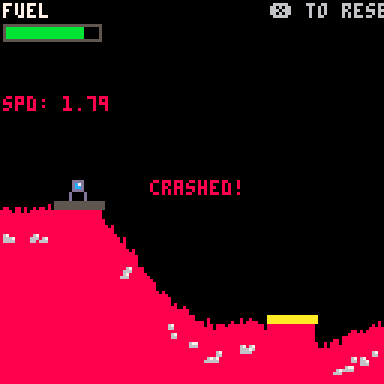

# Mini-Pico-Games
Made a repo for my pico experimentes, not enough pico code to find online, so I made a repo for random sketches.

## How to run?
Find PicoX directory: https://www.lexaloffle.com/dl/docs/picotron_manual.html#Drive_Storage

### If my files are .lua and stuff
Make a folder in your pico directory `game.p64` then move files in there.

### If my files are .p64
Just copy paste into the "drive" folder.

